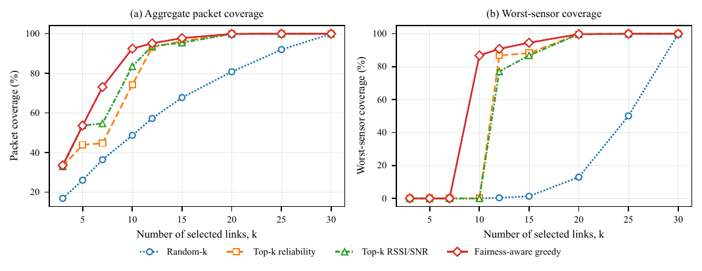
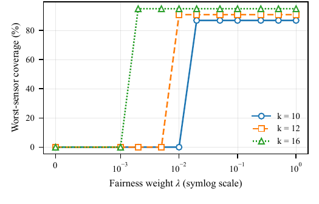

# Threshold-Aware Link-Graph Compression with Per-Sensor Coverage Guarantees and Temporal Robustness in Urban LoRaWAN Networks

Reproducibility repository for the manuscript of the same title. The code selects a minimum-cardinality subset of observed sensor–gateway links while enforcing both aggregate packet-coverage and per-sensor coverage requirements, and evaluates how the selected subsets behave under whole-period, retrospective, robust-static, and prospective temporal formulations.

## What is included

**Methods**

- Exact sensor-separable dynamic program for whole-period and month-specific optimisation
- Reusable fairness-aware and threshold-dependent multi-cover greedy methods
- Coverage-only, static-ranking, and random baselines

**Analyses**

- A 1,000-pair requirement grid and exact-optimum multiplicity analysis
- Temporal comparison of equal-cardinality subsets
- Retrospective monthly, robust all-month, and rolling prospective evaluations, including cold start and reconfiguration
- Synthetic scalability benchmark over larger sensor and gateway configurations

**Outputs**

- Manuscript-facing result and supplementary tables
- Vector PDF figures used in the manuscript, plus the additional temporal diagnostic

## Main result figures

### Coverage versus selected-link budget



[Vector PDF](paper_results/figures/coverage_vs_k.pdf) · [Numerical source](paper_results/18_method_comparison.csv)

### Sensitivity to the fairness weight



[Vector PDF](paper_results/figures/lambda_vs_worst_coverage.pdf) · [Numerical sources](paper_results/README.md)

The PNG files above are README previews only. The manuscript-facing figures remain the vector PDFs stored in `paper_results/figures/`.

## Repository layout

```text
src/lgc/
├── analysis/           ablations, wide-grid, subset-quality and temporal analyses
├── baselines/          random-k, reliability and RSSI/SNR rankings
├── exact/              exact sensor-separable dynamic program
├── greedy/             fairness-aware and multi-cover methods
├── config.py           experiment settings
├── io.py               loading, validation and dataset manifest
├── metrics.py          coverage and requirement helpers
├── model.py            packet–link representation
└── plotting.py         figure generation
scripts/                 command-line entry points and bundle exporter
tests/                   unit, regression and pipeline tests
paper_results/           manuscript-facing outputs
├── scalability/         synthetic scalability benchmark outputs
```

## Dataset

The experiments use the public University of Virginia LoRaWAN dataset:

- DOI: [10.18130/V3/RFTICK](https://doi.org/10.18130/V3/RFTICK)
- expected local file:

```text
<data-root>/dataset/lorawan_metadata/lorawan_combined_dataset.parquet
```

The source dataset is not redistributed in this repository. The analysis uses 2,091,512 reception records, which yield 1,232,813 unique observed uplink packets from 10 sensors and 3 gateways over 17 calendar months.

## Installation

The manuscript run used Python 3.12.3, NumPy 2.3.5, pandas 2.3.2, and SciPy 1.17.0.

Install the package and test dependencies with:

```bash
python -m pip install -e ".[dev]"
```

The exact Python, NumPy, pandas, and SciPy versions used for the manuscript run are also recorded in `environment.yml`.

## Reproduce the complete analysis

```bash
python scripts/run_all.py \
  --data-root <data-root> \
  --out-dir ./analysis_outputs \
  --include-temporal \
  --frozen-initial-months 3 \
  --compact-outputs
```

PowerShell:

```powershell
python .\scripts\run_all.py --data-root "<DATA_ROOT>" --out-dir ".\analysis_outputs" --include-temporal --frozen-initial-months 3 --compact-outputs
```

`--compact-outputs` skips the large packet-level CSV but does not change any reported calculations.

The 1,000-pair wide-grid stage is the slowest part of the pipeline. The sub-millisecond exact-DP values reported in the manuscript refer only to solving one precomputed whole-period instance and exclude dataset loading and reception-pattern construction.


## Synthetic scalability experiment

The optional scalability benchmark is run separately from the main reproduction pipeline. It samples synthetic per-link coverage probabilities from the 30 empirical UVA sensor–gateway coverage fractions, scales the number of sensors and gateways, and compares the fairness-aware ordering with the exact DP where local gateway-subset enumeration remains tractable.

```bash
python scripts/run_scalability_experiment.py \
  --data-root <data-root> \
  --out-dir ./scalability_outputs
```

PowerShell:

```powershell
python .\scripts\run_scalability_experiment.py --data-root "<DATA_ROOT>" --out-dir ".\scalability_outputs"
```

The default benchmark uses five seeds, 500 observed packets per synthetic sensor, `|S| = {10, 50, 100, 200, 500}` at three gateways, and `|G| = {3, 5, 10, 20}` at 50 sensors. Exact DP is skipped above 10 gateways because its sensor-local enumeration grows as `2^|G|`. The greedy method is still evaluated there. The synthetic model preserves the marginal per-link coverage distribution, not the full empirical cross-gateway dependence structure.

## Export the manuscript-facing bundle

After the pipeline finishes:

```bash
python scripts/export_publication_bundle.py \
  --out-dir ./analysis_outputs \
  --bundle-dir ./publication_bundle \
  --profile journal
```

The exporter copies the required result tables and vector PDF figures and creates:

```text
supplementary/Table_S1_per_month_feasibility_and_link_budget.csv
supplementary/Table_S2_oracle_budget_and_subset_similarity.csv
```

## Mapping between manuscript content and generated outputs

| Manuscript content | Main generated source |
|---|---|
| Figure 1: aggregate and worst-sensor coverage versus link budget | `18_method_comparison.csv`, `coverage_vs_k.pdf` |
| Reference requirement table | `26_stronger_baseline_threshold_comparison.csv` |
| Exact-DP runtime | `19b_exact_dp_runtime.csv` |
| 1,000-pair optimality evaluation | `27b_grid_summary_per_method.csv` |
| Proposed versus multi-cover subset identity | `27c_proposed_vs_multicover_summary.csv`, `27d_proposed_vs_multicover_divergences.csv` |
| Exact-optimum multiplicity | `28_optimum_multiplicity_main.csv` |
| Figure 2: fairness-weight sensitivity | `22b_lambda_threshold_summary_at_ref_k.csv`, `22c_lambda_subset_identity.csv`, `25_sensor_gap_by_lambda.csv`, `lambda_vs_worst_coverage.pdf` |
| Temporal quality of different equal-cardinality subsets | `29_equal_cardinality_subset_temporal_quality.csv`, `29b_proposed_vs_multicover_temporal_quality_summary.csv` |
| Retrospective monthly reoptimisation | `23_retrospective_monthly_reoptimization.csv`, `23b_retrospective_monthly_reoptimization_summary.csv` |
| Whole-period, monthly, and robust all-month budgets | `24_temporal_requirement_table.csv` |
| Prospective policies, reconfiguration, and cold start | `30_rolling_temporal_per_month.csv`, `30b_rolling_temporal_summary.csv` |
| Synthetic scalability evaluation | `scalability/32b_scalability_summary.csv`, `scalability/32d_scalability_metadata.json` |
| Supplementary Tables S1 and S2 | generated by `scripts/export_publication_bundle.py` |

Manuscript-facing outputs are stored in [`paper_results/`](paper_results/README.md). Outputs from the synthetic scalability experiment are stored in `paper_results/scalability/`.

The algorithm box is typeset directly in the manuscript source rather than exported by the analysis pipeline. `temporal_summary.pdf` is an additional diagnostic figure and is not required by the main manuscript.

## Deterministic settings

- Service thresholds are converted to integer packet-count targets using exact decimal ceiling arithmetic
- Greedy and static-ranking ties are resolved by lexicographic link identifier
- Within a fixed budget, the exact DP keeps the state with the greatest fitting-window packet count and then the first reconstruction path encountered
- Random-k uses seed 42 and 100 repetitions
- The main fairness-aware ordering uses `lambda = 1.0`
- The frozen policy is fitted on the first three calendar months
- The wide grid uses `P_min = 80..99` and `S_min = 50..99`

## Tests

```bash
python -m pytest
```

The test suite contains 32 tests covering solver checks, deterministic tie cases, temporal cold start, robust-static and rolling policies, scalability checks, publication regressions, and supplementary-table export.

## License and citation

The source code and repository documentation authored for this project are released under the [MIT License](LICENSE). The original UVA LoRaWAN dataset is not redistributed here and remains subject to the terms set by its publisher. The files in `paper_results/` are derived research outputs provided to support verification of the manuscript and do not replace or relicense the source dataset.

Citation metadata for the software are provided in [`CITATION.cff`](CITATION.cff).
